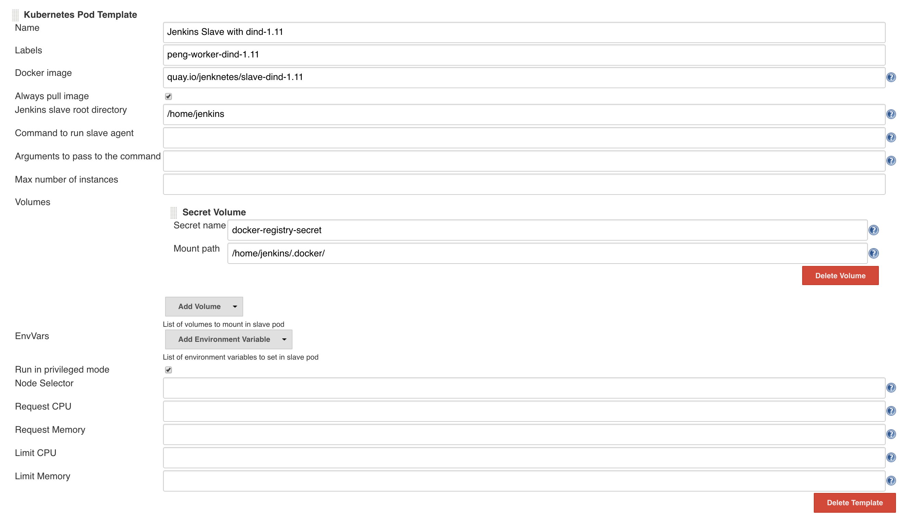

# Jenknetes - Jenkins slaves made for a K8s world

## Why
In our projects we wanted to dynamically start Jenkins slaves in our Kubernetes cluster, run our build containers in there, build and push our Docker images and leave the build host in a clean state.
We found an easy solution to start slaves with the link:https://wiki.jenkins-ci.org/display/JENKINS/Kubernetes+Plugin[Kubernetes Plugin] but we had no easy to use Docker-in-Docker images that were also capable of being a Jenkins slave at the same time.

## Goal
Although we have so far used these images in combination with the `Kubernetes Plugin`, it is not directly bound to it.
So far we haven´t tried deploying them separately to a Kubernetes cluster and link them with the Jenkins master, but we would love to see somebody doing (and documenting) it.

Two main goals we wanted to achieve:

* Image isolation between the host system and the built container - don´t trash the host system
* Reproducable image builds - Docker version should not depend on the version installed on the host system

## Getting started
We started using the link:https://wiki.jenkins-ci.org/display/JENKINS/Kubernetes+Plugin[Kubernetes Plugin] to configure a Jenkins cloud running in our K8s cluster.
This cloud deploys Docker based Jenkins slaves dynamically as soon as a new job starts.

Here you can find a sample configuration using the dind-1.11 image:

The `Label` inside the `Kubernetes Pod Template` can later be used in the `Jenkinsfile` as the node name.

### Docker images
Currently we have 2 running images and we are happy if you share your experiences and help us improve them or create new ones:

* Docker-in-Docker 1.11 + Jenkins Slave: `quay.io/jenknetes/slave-dind-1.11`
* Docker-in-Docker 1.12 + Jenkins Slave: `quay.io/jenknetes/slave-dind-1.12`
